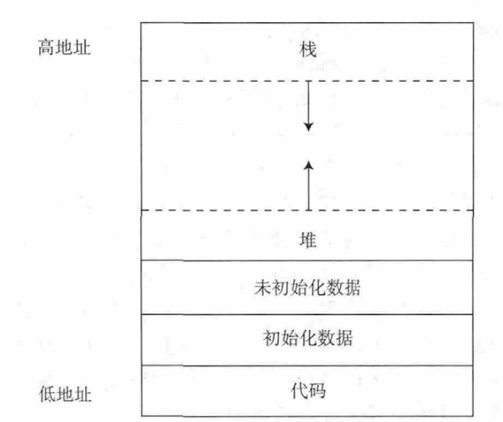

封面图：[https://www.pixiv.net/artworks/95681846](https://www.pixiv.net/artworks/95681846)

曾经我以为没有递归的程序阅读题都是渣渣，直到……
## 题目描述
下面代码进行数组与指针的操作，已知&score[0]的值为 0x00FF2000。
```C
#include <stdio.h>
int main()
{
short int *p1;
long int *p3;
short int score[10] = { 1,2,3,4,5,6,7,8,9 };
p1 = score;
p3 = (long int*)score;
printf("%p, %p\n", p1 + 1, p3 + 1);
printf("%d, %d\n", *p1, *p3);
return 0;
}
```
(1) 请说明数组名score 的含义。

(2) 写出程序执行结果。

非官方答案：
```
(1)指向数组score头元素的指针
(2)
0x00FF2002 0x00FF2004
1 131073
```
注：在64位linux系统上时，第一个printf输出的第二个数应为0x00FF2008
## 题目详解
首先第一小题完全莫名其妙，不讲。

有意思的是第二小题，这个程序有两个`printf`语句，第一个`printf`主要考察指针运算。众所周知，假设指针的类型长度为`n`，那么指针加`k`，指针实际移动`n*k`。在本例中，指针`p1`的类型是`short int *`，`short int`的类型长度是2个字节，此处`p1+1`，实际地址增加2，即`0x00FF2002`。`p3+1`同理。但是这里有个小坑，`long int` 在64位linux系统上是8个字节，在windows上是4个字节。实际考试中应指定`long int`长度。

第二个printf语句是输出两个指针对应的内容。我们先忽略格式控制符，看后面的两个参数。第一个参数是`*p1`，又因为`p1=score`，`p1`和`score`都是`short int *`类型，所以毫无疑问这里是取`score[0]`，也就是`1`。第二个参数是`*p3`，也有`p3=score`，但是p3是`long int *`，在它执行`*`运算的时候会一次取`long int`长度的内容，也就是取4个字节。然而，一个`short int`类型只占2个字节，所以这里发生了访问溢出。那么这里到底取出来了什么呢？这就需要从内存里分析了。
### 程序内存分配分析
相信大家都很熟悉下面这张图：

这张图展示了计算机内存分配的顺序。我们知道，对于局部变量，系统在栈区从高地址向低地址分配内存。
而在数组内部则是从低地址向高地址分配内存。因此变量相对位置如表：
| 内存内容   | 内存属主 |
| ---------- | -------- |
| 0x00FF2000 | p1       |
| 0x00FF2000 | p3       |
| 未知       | score[9] |
| 9          | score[8] |
| 8          | score[7] |
| 7          | score[6] |
| 6          | score[5] |
| 5          | score[4] |
| 4          | score[3] |
| 3          | score[2] |
| 2          | score[1] |
| 1          | score[0] |

当进行`*p3`操作时，从低地址向高地址进行操作，取出的即为score[0]和score[1]占用的内存空间。

### 计算机中的整数
一般来说，整数以补码的形式存储在内存中。
> 正数的补码等于其原码，负数的补码等于模减去其绝对值的原码

考虑到short int 占两个字节，也就是16位二进制，4位十六进制，那么可以得到：
```C
(short int)1=0000000000000001B=0001H
(short int)2=0000000000000010B=0002H
```
在常用家用计算机（小端机）中，数字**高位存储在高地址，低位存储在低地址**，在虚拟内存中，最小操作单位是字节，也即两位16进制。因此在虚拟内存中存储情况类似：
| 内存内容 |
| -------- |
| 高地址   |
| 00H      |
| 02H      |
| 00H      |
| 01H      |
| 低地址   |
### 回到`*p3`
当`*p3`取数时，取出的即为上面这一串十六进制。我们按我们习惯的高位在前进行拼接，最终结果就是`00020001H`，即`131073`。
除此之外，我们还需要关注格式控制符。幸运的是，这里的格式控制符是`%d`，在Windows平台下刚好能够兼容`*p1`和`*p3`，因此没有什么问题。于是我们能够得出最后的结果：
```
1 131073
```
## 总结
其实这是一道非常简单的关于内存分配的题目，不过涉及到比较复杂的内存分配机制问题，所以记个笔记来记录一下。