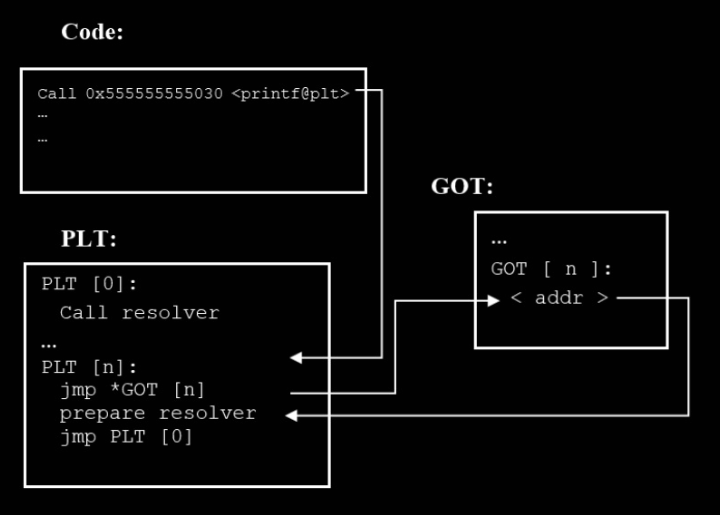

封面图：[https://www.bilibili.com/opus/993288080028860441](https://www.bilibili.com/opus/993288080028860441)

## 引言
迄今为止，缓冲区溢出已被识别为最常见且最危险的漏洞。根据 2019 年通用漏洞和暴露（CVE）列表，它是报告频率最高的漏洞，报告了超过 400 个漏洞。截至 2021 年 5 月，CVE 数据库中报告的缓冲区溢出漏洞数量已达到 13,700 多个。在所有缓冲区溢出漏洞中，基于栈的缓冲区溢出是最常见的类型。本文将介绍各种用于缓解缓冲区溢出漏洞的机制和它们的绕过方法，并介绍最近的一个栈溢出漏洞 [CVE-2024-9632](https://www.cve.org/CVERecord?id=CVE-2024-9632)。

## 基于硬件的缓解技术
基于硬件的缓解技术中，最著名的就是 NX（No-eXecute）技术。NX 技术是一种硬件支持的内存保护技术，它通过在内存页表中设置一个标志位来防止代码执行。当试图执行一个被标记为不可执行的内存区域时，CPU 会产生一个异常，从而阻止攻击者执行恶意代码。还有一些其它的研究工作，如 SmashGuard 通过在 CPU 上实现一个硬件堆栈来保存返回地址，HSDefender 通过设计安全的`call`指令来防止栈溢出攻击等。以下主要介绍 NX 技术。
### NX技术
在冯诺依曼架构中，使用相同的内存空间来存储代码和数据。这是通过分页来实现的，但分页机制不允许用户在特定内存区域上独立设置读写和执行权限，而仅允许三种权限：non-accessible、readable-executable（RX）和 readablewriteable-executable（RWX）。因此，如果页面设置了可读写，那么它就一定是可执行的。攻击者可以利用这一点，将恶意代码注入到内存中，并通过覆盖返回地址的方式来执行恶意代码。为了解决这个问题，NX技术被引入到现代 CPU 中。

操作系统可以通过操作NX位来将某些内存区域标记为不可执行。NX 的位号是 63，这是页表中最高有效位。如果特定页面的 NX 位设置为 0，则可以执行该代码；如果设置为 1，则它是仅包含数据的不可执行页面。NX（no-execute）功能仅适用于 64 位模式。NX 功能的一个重要之处在于它是运行时策略，应用无需重新编译即可从此功能中受益。操作系统利用 NX 位将堆栈/堆内存标记为不可执行，从而防止了相当一部分利用缓冲区溢出的代码注入攻击。
### NX技术的绕过
为了绕过 NX 技术，一种常见的思路是代码重用攻击。代码重用攻击是一种利用程序中已有的代码片段来实现攻击目的的攻击方式。这种攻击方式不需要向内存中注入恶意代码。ROP攻击是一种高级形式的代码重用攻击。以下介绍 ROP 攻击的基本原理。
#### ROP攻击
ROP 使用预先存在的名为 “gadgets” 的小指令序列来实施攻击。这些 gadgets 是结合在一起可以执行高级任务的短指令序列。gadgets 必须是有效的以返回指令结尾指令序列，从而让 CPU 继续执行下一个 gadgets 或有效载荷。在发起攻击时，攻击者通常会用跳转到第一个 gadgets 的代码指针覆盖堆栈上保存的返回地址。ROP 攻击的流程图如下：


常见的可用于 ROP 攻击的 gadgets 包括 `pop rdi; ret` 和 `system()` 等。`system()` 函数可以执行系统命令，而 `pop rdi; ret` 可以将参数传递给 `system()` 函数。通过将这两个 gadgets 结合在一起，攻击者可以执行任意系统命令。在查找 gadgets 的步骤，攻击者可以通过各种调试器和反汇编工具来在二进制文件中查找这些指令。

## 基于操作系统的缓解技术
有许多基于操作系统的缓解技术。例如 libsafe 通过修改标准库来提供更安全的函数，地址混淆和二进制搅拌技术都是在加载时对目标二进制文件进行修改，以使攻击者难以找到目标函数的地址。而最常见的基于操作系统的缓解技术是 ASLR 技术。以下主要介绍 ASLR 技术。
### ASLR技术
在上文中介绍了 ROP，其必须知道 gadgets 的地址。ASLR随机化进程各个部分的基址，包括堆栈、堆、共享库和可执行文件。因此，攻击者不能每次都使用相同的漏洞来滥用相同的易受攻击的程序。每次程序运行时，系统会将程序的代码段、堆、栈以及动态库加载到不同的随机地址。攻击者无法直接预测这些关键区域的精确地址，从而难以利用固定地址的内存漏洞。
### ASLR技术的绕过
在 32 位系统中，ASLR 技术的绕过相对容易，因为 32 位系统的内存地址空间相对较小，ASLR 的随机性有限，地址中通常只有 8 或 16 位被随机化。攻击者可以通过不断尝试可能的内存地址来暴力破解 ASLR。在 64 位系统中，地址中有 40 位被随机化，因此暴力破解的难度大大增加。但是，攻击者仍然可以通过泄露内存地址和信息泄露等方式来绕过 ASLR。以下主要介绍信息泄露技术。
#### 信息泄露技术
信息泄露技术的流程如下：


其中一种信息泄露方法是利用过程链接表（PLT）和全局偏移表（GOT）这两种数据结构。PLT 是一种数据结构，用于调用外部函数，这些函数的地址在运行时由动态链接器解析。GOT 是一个数组，其中包含进程当前使用的全局变量和库函数的绝对地址。当程序调用函数时，查找 PLT 中的条目，条目中包含跳转指令，可以跳转到 GOT 中的条目。GOT 调用动态链接器来获取函数地址并存储在自己的条目中，这样程序就可以通过函数地址来调用函数。如下图所示。



通过获取 PLT 和 GOT 中的地址，攻击者可以泄露程序中的地址信息，从而绕过 ASLR。具体地说，利用调试器可以获取某个函数的 PLT 地址，之后反汇编该地址的指令就能获得 GOT 的地址。通过获得 GOT 中的地址，攻击者可以获取到函数的绝对地址。之后通过库文件来获取其它函数和该函数的相对偏移，就可以利用该函数的地址加上相对偏移来调用任意库函数。

另外，`printf()` 函数也是一个常用的信息泄露工具。如果攻击者可以修改 `printf()` 函数的格式控制字符串，就可以泄露栈上的数据。例如，通过 `%lx` 格式控制字符，攻击者就可以获得泄露的内存地址。

## 基于编译器的缓解技术
有许多缓解技术在编译器这一层面实现。其中一些可视为对基于操作系统和硬件的缓解技术的补充。例如，PIC 技术将代码编译为位置无关的机器码指令，从而让这些指令可以被加载到任意地址；PIE 技术编译出的可执行文件的不同部分可以使用不同的基址，从而增加了攻击者猜测基址的难度。这两个技术都是 ASLR 的补充。另一些技术则从其它方面进行保护，例如 StackGuard, ProPolice, Address Sanitizer 等。基于编译器的缓解技术很多，且大多数都在主流编译器中有广泛应用，无法一一列举，以下主要介绍 RELRO 和 StackGuard 两种技术。

### RELRO技术
RELRO 技术是一种保护机制，用于防止全局偏移表（GOT）被攻击者利用。在首次调用共享库函数时，动态链接器会将 GOT 表中的地址填充为真实地址。也就是说，GOT 表在程序运行时是可写的。并且，GOT 表需要位于已知位置，因为它包含了程序运行时的必要信息。这给了攻击者一个机会，可以通过覆盖 GOT 表中的地址来执行恶意代码。

RELRO 技术通过将 GOT 表标记为只读来解决这个问题。RELRO 技术有两种类型：Partial RELRO 和 Full RELRO。Partial RELRO 会在程序启动时将 GOT 表的部分标记为只读，通常只保护不频繁改变的全局变量和一些只读数据段。动态链接中的某些函数指针仍可能被攻击者利用。Full RELRO比Partial RELRO更安全，它会在程序加载完成后，将整个GOT段标记为只读。所有GOT表项，包括动态链接的函数指针，都会被标记为只读，彻底防止了指针修改。其缺点是对程序启动速度影响较大，因为它要求在程序运行前完成所有符号解析。

### RELRO技术的绕过
RELRO 技术的绕过方法主要针对 Partial RELRO。对于 Partial RELRO，动态链接中的某些函数指针未受保护，例如 `printf()` 函数。可以通过覆写 GOT 表中的 `printf()` 函数指针来执行任意代码。

### StackGuard 技术
StackGuard 通过在返回地址旁边插入一个“护符”（Canary）来防止返回地址被修改。该护符将会挡在缓冲区和返回地址之间。在函数体执行完毕后，控制返回前，它会将护符与保存在其它位置的副本进行比较，只有当护符保持不变时，才会跳转到函数的返回地址。在常规的栈溢出攻击中，攻击者采用的方法是线性、顺序且按升序覆盖字节。这使得在不覆盖护符的情况下改变返回地址几乎不可能。

### StackGuard 技术的绕过
绕过 StackGuard 技术的主要思路是想办法找到护符的值。刚刚提到，护符位于缓冲区和返回地址之间的某个位置，同时在其它位置还会有护符的副本；在程序返回时，为了检查护符是否被篡改，护符通常还会被加载到寄存器中。这些情况为信息泄露攻击提供了机会。通过信息泄露攻击，攻击者可以获取到护符的值，从而绕过 StackGuard 技术。

## 漏洞 CVE-2024-9632 介绍
[CVE-2024-9632](https://www.cve.org/CVERecord?id=CVE-2024-9632) 漏洞是一个缓冲区溢出漏洞。该漏洞存在于 `xorg-xserver` 中。该软件是 Linux 系统下最常见的显示服务器，用于管理图形显示设备。本地攻击者可以通过利用该漏洞发起拒绝服务攻击，如果 `xorg-xserver` 以 root 权限运行，攻击者还能获得提升的权限，甚至完全控制系统。该漏洞被标记为高危险性。

### 漏洞原理
产生漏洞的代码如下：
```c
        XkbSymInterpretPtr sym;
        unsigned int skipped = 0;

        if ((unsigned) (req->firstSI + req->nSI) > compat->num_si) {
            compat->num_si = req->firstSI + req->nSI;
            compat->sym_interpret = reallocarray(compat->sym_interpret,
                                                 compat->num_si,
                                                 sizeof(XkbSymInterpretRec));
            if (!compat->sym_interpret) {
                compat->num_si = 0;
                return BadAlloc;
            }
        }
```
其中，`compat->sym_interpret` 是一个数组，存储了 `XkbSymInterpretRec` 类型的结构体，每个结构体表示一种键盘符号（symbol）与修饰符（modifier）组合的解释方式。该解释方式用于决定在特定符号与修饰符输入下应该执行的操作，例如：
- 激活一个功能键。
- 触发一个特定的动作（如执行 XFree86 私有动作 `XkbSA_XFree86Private`）。

而 `compat->num_si` 是一个整型变量，记录当前 `compat->sym_interpret` 数组中元素的个数。

在这段代码中没有出现的还有一个变量，那就是 `compat->size_si`。该变量用于记录 `compat->sym_interpret` 数组的容量。它和 `compat->num_si` 的区别在于，`compat->num_si` 记录的是当前数组中的元素个数，而 `compat->size_si` 记录的是数组的容量。也就是说，在理想情况下，`compat->num_si` 应该永远小于等于 `compat->size_si`。当 `compat->num_si` 等于 `compat->size_si` 时，表示数组已满。

`xorg-xserver` 允许客户端发起更新 `compat->sym_interpret` 数组的请求。请求中的 `firstSI` 和 `nSI` 字段分别表示要更新的数组元素的起始位置和更新的元素个数。当它们之和超过了当前元素个数时，表示客户端需要增加数组的大小。`reallocarray` 函数会重新分配内存，以容纳新的元素。这就是这段代码的主要工作。

然而，这段代码中仅仅更新了 `compat->num_si`，而没有更新 `compat->size_si`。这样就可能不再满足上文提到的 `compat->num_si` 应永远小于等于 `compat->size_si` 的假设。在之后，它调用 `reallocarray` 将 `compat->sym_interpret` 调整为了 `compat->num_si` 的大小。这就导致数组被分配到的内存空间超过了它本应占有的内存空间 `compat->size_si`，从而导致了缓冲区溢出漏洞。攻击者可以通过构造一个特别长的更新请求来触发这个漏洞。

### 防御措施
以下是修复补丁，[相关链接](https://gitlab.freedesktop.org/xorg/xserver/-/commit/85b776571487f52e756f68a069c768757369bfe3.diff)
```diff
@@ -2990,13 +2990,13 @@ _XkbSetCompatMap(ClientPtr client, DeviceIntPtr dev,
         XkbSymInterpretPtr sym;
         unsigned int skipped = 0;
 
-        if ((unsigned) (req->firstSI + req->nSI) > compat->num_si) {
-            compat->num_si = req->firstSI + req->nSI;
+        if ((unsigned) (req->firstSI + req->nSI) > compat->size_si) {
+            compat->num_si = compat->size_si = req->firstSI + req->nSI;
             compat->sym_interpret = reallocarray(compat->sym_interpret,
-                                                 compat->num_si,
+                                                 compat->size_si,
                                                  sizeof(XkbSymInterpretRec));
             if (!compat->sym_interpret) {
-                compat->num_si = 0;
+                compat->num_si = compat->size_si = 0;
                 return BadAlloc;
             }
         }
```
从补丁文件中可以看出，主要的修复措施是在更新 `compat->num_si` 时，同时更新 `compat->size_si`。这样就保证了 `compat->sym_interpret` 数组的大小不会超过它的容量。

## 总结
本文介绍了缓冲区溢出漏洞的概念，以及各种缓解缓冲区溢出漏洞的技术。其中，NX 技术通过将内存区域标记为不可执行来防止代码注入攻击；ASLR 技术通过随机化进程各个部分的基址来增加攻击者猜测基址的难度；RELRO 技术通过将 GOT 表标记为只读来防止攻击者利用 GOT 表；StackGuard 技术通过在返回地址旁边插入一个护符来防止返回地址被修改。最后，本文介绍了一个最近的栈溢出漏洞 [CVE-2024-9632](https://www.cve.org/CVERecord?id=CVE-2024-9632) 的原理和修复措施。可以看到，尽管有了这些防御措施，但仍然有很多方法可以绕过这些技术，而错误的代码实现也会导致漏洞的产生。现有的漏洞缓解技术仍有很大提升空间，值得进一步研究。同时开发者也应该在编写代码时遵循安全编程规范，同时关注最新的漏洞信息，及时修复已知的漏洞。