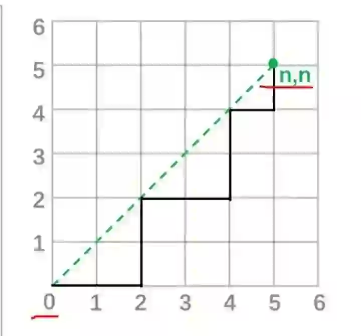
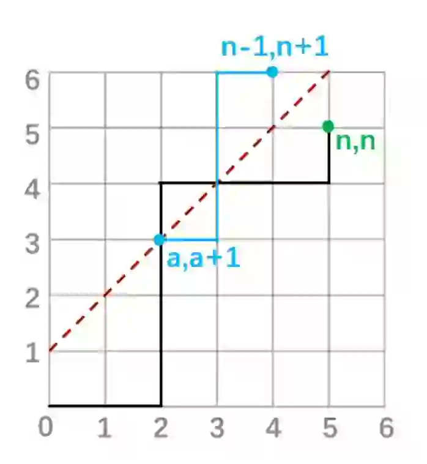
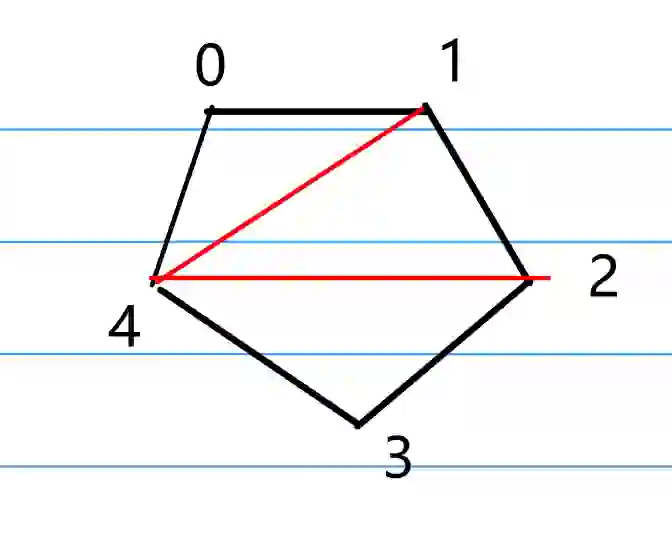

## 应用背景
用到卡特兰数的经典问题有：
1. **括号匹配问题**：计算 $n$ 对括号正确配对的方案数。
2. **二叉树计数**：计算有 $n$ 个内部节点（非叶节点）的二叉树的不同形态数。
3. **路径计数**：在格点中，从原点到 $(2n, 0)$ 点，不穿过对角线的路径数。
4. **分割问题**：将一个凸多边形分割成n个三角形的不同方法数。
5. **括号表达式**：计算包含n对括号和n个不同运算符的有效算术表达式的数量。
6. **栈操作**：给定一系列进栈和出栈操作，计算不违反栈原则的操作序列数。

当你拿到一个问题时，你可以通过以下步骤来确定它是否能用卡特兰数来解决：

1. **递推关系**：如果问题的解决方案可以分解为两个子问题，并且这两个子问题的解的乘积构成了原问题的解，特别地，递推公式形如 $H_n=\sum_{k=0}^{n-1}H_kH_{n-1-k}$ 那么这个问题可能可以用卡特兰数来解决。
2. **对称性**：卡特兰数通常出现在具有某种对称性的问题中。如果问题具有对称性，这可能是一个线索。
3. **排除非法状态**：许多卡特兰数问题都涉及到在构建过程中排除非法状态。例如，在括号匹配问题中，不能出现右括号多于左括号的情况。
4. **计数问题**：卡特兰数通常用于计数问题，尤其是那些涉及到某种“平衡”或“结构”的问题。
5. **匹配和划分**：如果问题是关于如何匹配或划分对象，且匹配或划分需要遵循特定的规则，那么它可能可以用卡特兰数来解决。
6. **找规律**：可以在小的数据规模上计算问题的答案，如果发现问题的答案与卡特兰数的前几项 $1, 1, 2, 5, 14, 42, 132, 429, 1430, 4862$ 相同，那么该问题可能可以用卡特兰数来解决。

## 例题引入
我们通过两个例题来引入卡特兰数的计算方法。

如图，从格点 $(0,0)$ 走到格点 $(n,n)$ ，只能向右或向上走，且不能穿过对角线，求路径数。



先不考虑对角线的限制。从格点 $(0,0)$ 到格点 $(n,n)$ ，因为只能向右或者向上，所以只能是 $n$ 步向右，$n$ 步向上，总共要走 $2n$ 步。我们可以从 $2n$ 步中任选 $n$ 步向右，剩下 $n$ 步向上，就能组成一条路径。所以路径总数为 $C_{2n}^n$。

之后考虑这些路径中穿过了对角线的路径数。可以画一条线为 $y=x+1$，所有穿过了对角线的路径必然与这条线相交，而没有穿过对角线的路径必然不与这条线相交。我们假设穿过了对角线的路径与该线的交点为P，将P点右侧的路径以 $y=x+1$ 为对称轴进行对称，注意到 $(n,n)$ 的对称点是 $(n-1,n+1)$，所以就可以得到一条连接 $(0,0)$ 和 $(n-1,n+1)$ 的路径。如下图所示。对称地思考，连接 $(0,0)$ 和 $(n-1,n+1)$ 的路径数就等于所有穿过了对角线的路径数，即 $C_{2n}^{n-1}$。



所以答案就是 $C_{2n}^n-C_{2n}^{n-1}$。这就是卡特兰数的一个通项公式。

接下来我们从另一个角度来推出卡特兰数。考虑凸多边形的划分问题。将一个凸 $n$ 边形的顶点从0到n-1进行编号，之后将其划分成 $n-2$ 个三角形，如图，求划分方法数。



我们可以任取一个点k，将多边形划分成三角形 $0,k,n-1$和两个多边形，分别是 $0,1,...,k$ 和 $k,k+1,...,n-1$。这两个多边形的边数分别是 $k+1$ 和 $n-k$，那么划分方法数就是将这两个多边形分别划分的方法数的乘积。所以得到递推关系 $f_n=\sum_{k=1}^{n-2}f_{k+1}f_{n-k}$，其中 $f_2=1$。该数列是从2开始的，我们不妨令 $H_n=f_{n+2}=\sum_{k=1}^{n}f_{k+1}f_{n+2-k}=\sum_{k=1}^{n}H_{k-1}H_{n-k}=\sum_{k=0}^{n-1}H_kH_{n-1-k}$，其中 $H_0=1$。我们可以求出 $H_n$ 的前几项，可以发现它和上一道题的 $C_n$ 是同一个数列。因此，这就是卡特兰数的递推公式。从该递推公式严谨地推导通项公式并不容易，这里就不展开了。

## 卡特兰数的通项公式
卡特兰数的常用通项公式有：

$$
H_n=C_{2n}^n-C_{2n}^{n-1}
$$

$$
H_n=\frac{1}{n+1}C_{2n}^n
$$

常用的递推公式有：

$$
H_n=\frac{4n-2}{n+1}H_{n-1}
$$

这些公式之间的转换推导很简单，这里就不展开了。在实际应用中，卡特兰数也经常会以上文中例题2的形式出现。但是例题2的形式不太方便计算，我们可以通过递推式计算出答案的前几项，找到它和通项公式的对应关系，之后用通项公式求解。

在实际计算中，我们常常不能直接计算 $C_{2n}^n$，而往往也采用递推的方式计算组合数。因此，以上的公式在实际应用时通常都表现为递推的形式。

## 实操演练

[洛谷P10413](https://www.luogu.com.cn/problem/P10413)

### [蓝桥杯 2023 国 A] 圆上的连线

#### 题目描述

给定一个圆，圆上有 $n=2023$ 个点从 $1$ 到 $n$ 依次编号。

问有多少种不同的连线方式，使得完全没有连线相交。当两个方案连线的数量不同或任何一个点连接的点在另一个方案中编号不同时，两个方案视为不同。

答案可能很大，请将答案对 $2023$ 求余后提交。

#### 输入格式

这是一道结果填空题，你只需要算出结果后提交即可。本题的结果为一个整数，在提交答案时只填写这个整数，填写多余的内容将无法得分。

#### 输出格式

这是一道结果填空题，你只需要算出结果后提交即可。本题的结果为一个整数，在提交答案时只填写这个整数，填写多余的内容将无法得分。

### 解题思路

这道题是卡特兰数的变式。首先它没有要求所有点都要连线，因此我们首先要确定连线的点的数量。连线的点必须是偶数个，因此，挑选点的方案数是 $C_{2023}^{2k}, 1 \leq k \leq \frac{2023}{2}, k\in N$。此时参与连线的点的数量为 $2k$。因为要求连线不能相交，那么一条连线可以将圆分成两个部分，这两个部分的连线方式是独立的。并且为了确保两个部分都能合法地连线，两个部分包含的点的数量都必须是偶数。大圆的连线方案数就是两个部分的连线方案数的乘积。这里就能看出是一个卡特兰数的问题。不妨将选中的点中编号最低的点 $p$ 固定，然后选择 $p+2i+1$ 和其连线，那么连线就将剩余的点分为 $2i$ 和 $2k-2i-2$ 两个部分。假设 $2k$ 个点的连线方案数为 $H_{k}$，那么递推关系为 $H_{k}=\sum_{i=0}^{k-1}H_{i}H_{k-i-1}$，也就是卡特兰数的递推公式。最后，答案还需要乘上挑选点的方案数，因此，最终结果是 $ans=\sum_{k=1}^{1011}C_{2023}^{2k}H_{k}$。

在实际编程时，我选择 $H_n=C_{2n}^n-C_{2n}^{n-1}$ 的形式来计算卡特兰数。注意题目要求对 $2023$ 求余，因此我们需要谨慎挑选计算组合数的方法。在这里我使用了 $C_{n}^{m}=C_{n-1}^{m-1}+C_{n-1}^{m}$ 的递推式来计算组合数。

### 源代码

```cpp
#include <iostream>
using namespace std;
const int n = 2023, m = 2023;
long long c[n + 5][n + 5];
int main()
{
    c[0][0]=1;
    for (long long i = 1; i <= n; i++)
    {
        c[i][0] = 1;
        for (long long j = 1; j <= i; j++)
            c[i][j] = (c[i-1][j-1] + c[i-1][j] )%m;
    }
    int ans = 0;
    for (int i = 0; i <= 2023; i += 2)
    {
        int h = c[i][i / 2] - c[i][i / 2 - 1];
        ans+=c[n][i]*h%m;
        ans%=m;
    }
    cout << ans;
    return 0;
}
```