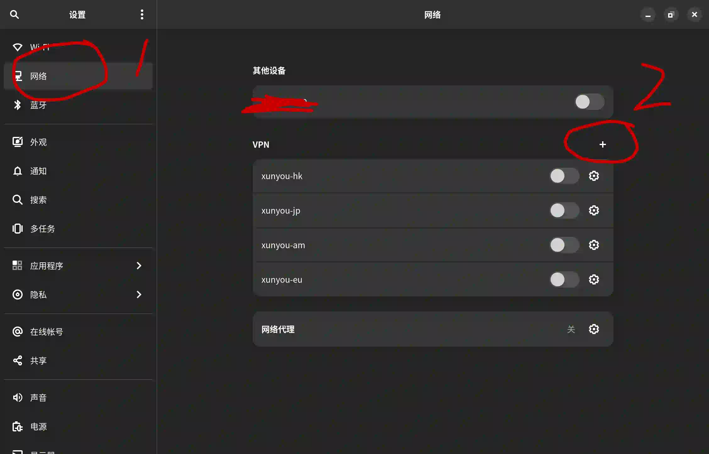
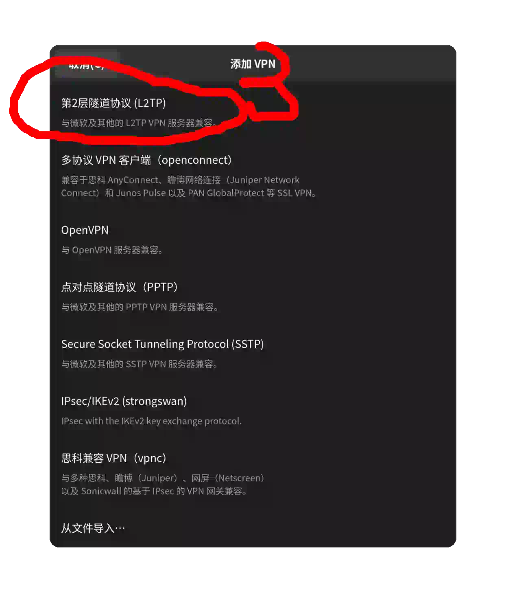
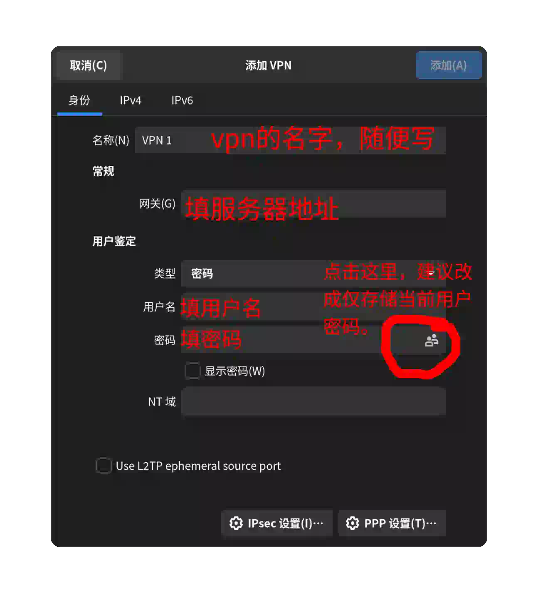
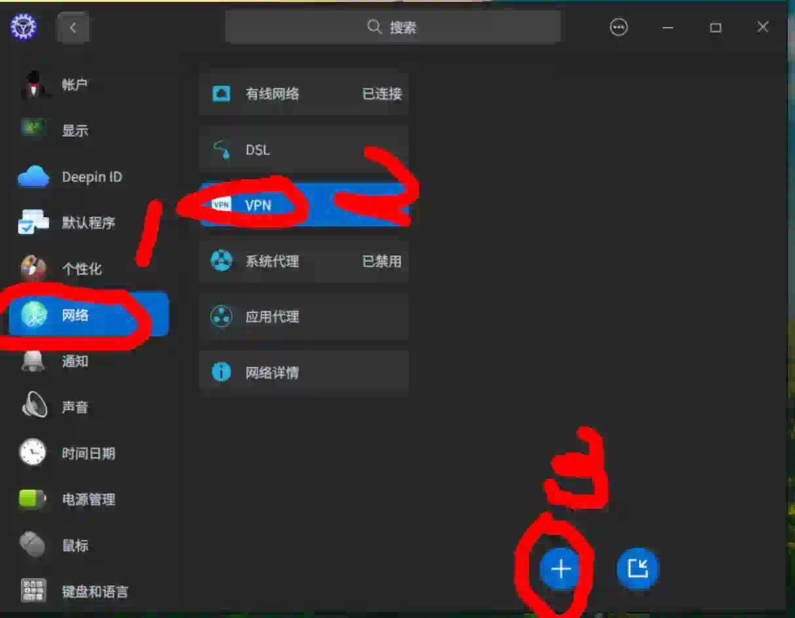
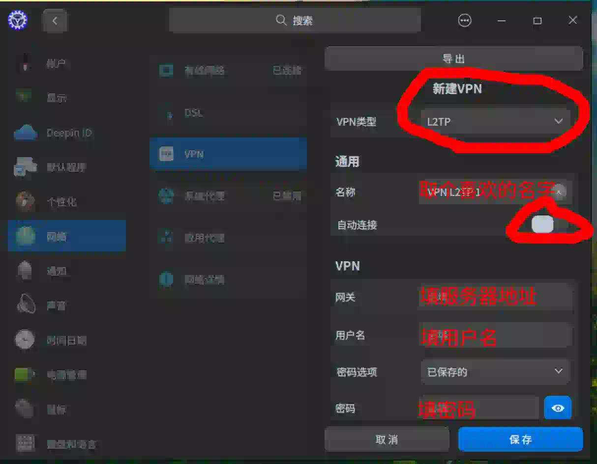

## 前言
proton等技术的发展让linux的游戏能力越来越好了。然而对于国内的游戏玩家来说，还有一个大问题就是网络问题。Linux上游戏网络加速目前主要有以下几种方式：
1. 原生客户端。网易uu加速器提供了steam deck插件，该插件同样适用于一般的Linux。该插件需要配合手机客户端使用，不过手机客户端仅作为控制器，加速过程并不需要手机和电脑连接到同一局域网。参考[SteamDeck插件安装步骤 Q&A](https://router.uu.163.com/app/html/online/baike_share.html?baike_id=63ec9d92b2d9f77dc9a8dde6)
2. 共享加速。该方法是很多加速器主机加速功能的主要方法。需要在手机、电脑或路由器上安装加速器客户端，然后将Linux连接到同一网络，然后使用主机加速功能进行加速。雷神加速器、迅游加速器以及刚刚提到的uu加速器都支持这种方式。如果你的电脑性能足够好，可以考虑使用虚拟机来运行加速器客户端。
3. 虚拟机/wine运行加速器客户端。部分加速器的部分加速方式可以通过虚拟机或者wine来运行。该方法也是唯一不需要使用主机加速功能的方法，适合加速那些没有上线主机的游戏。使用虚拟机运行加速器客户端的方法可以参考[https://hu60.cn/q.php/bbs.topic.95932.html](https://hu60.cn/q.php/bbs.topic.95932.html)，使用wine的方法可以参考[https://winegame.net/games/uu/](https://winegame.net/games/uu/)的脚本2和脚本3。
4. 使用VPN加速。也就是本文介绍的方法。该方法需要使用VPN来连接到加速器的服务器，然后通过加速器的服务器来访问游戏服务器。这种方法的优点是不需要额外的软件，目前似乎只有迅游加速器的SVIP支持这种方式。虽然这种方式也是主机加速，但是它连接到节点而非选择游戏，所以可以用于加速大部分游戏，不受主机加速器支持的游戏的限制。

**注意：本文所述方法需要迅游SVIP方能使用**

本文主要介绍使用迅游加速器的主机VPN加速功能进行游戏加速。本文中系统使用的网络管理工具是networkmanager，这是被ubuntu、deepin、manjaro等主流系统所接受的网络管理工具。如果你使用的是其它网络管理工具，请自行查阅相关文档。

本文会涉及到的Linux发行版包括Arch/Manjaro，Ubuntu，Deepin。对于其它发行版，操作大同小异。

## 软件准备
### Arch/Manjaro
[networkmanager-l2tp](https://archlinux.org/packages/community/x86_64/networkmanager-l2tp/)
```bash
sudo pacman -Syu networkmanager-l2tp
```

### Ubuntu
```bash
sudo apt install network-manager-l2tp
```
如果你使用的是gnome桌面环境，还可以安装
```bash
sudo apt install network-manager-l2tp-gnome
```
来使用gnome的图形界面来设置l2tp vpn

### GUI
很多主流桌面环境在它们的设置中集成了networkmanager的设置。如果你的桌面环境没有提供此功能，你仍可通过`nm-connection-editor`来使用GUI配置networkmanager。**ubuntu已预装该软件**，对于Arch，它在extra仓库中，可以通过pacman安装：
[nm-connection-editor](https://archlinux.org/packages/?name=nm-connection-editor)

```bash
sudo pacman -Syu nm-connection-editor
```

## VPN配置
### 获取迅游节点信息
首先你需要有一个迅游SVIP帐号。之后打开[https://pay.xunyou.com/u/#host](https://pay.xunyou.com/u/#host)，访问迅游个人中心的**主机加速**页面。迅游提供了港服、日服、美服、欧服四个服务器的主机加速节点。我们一一对应地创建4个vpn，这样只要连接到不同的vpn，就能连接到不同的节点。
### Gnome图形界面
打开gnome设置，网络，VPN，点击加号，选择“第二层隧道协议(L2TP)“，名称取自己喜欢的，在”网关“一栏填入从迅游那里得到的服务器地址，用户名和密码栏照写。密码栏右侧小图标可以点击，建议改成仅为当前用户存储密码。然后点右上角添加即可。如图：






之后直接在gnome网络设置界面打开开关即可连接到对应的vpn。也可以在gnome右上角控制栏里面找到切换开关。需要注意的是，如果你要切换到另一个节点，你需要先手动关闭前一个vpn连接再开启新的vpn连接，否则会报错。

### deepin(DDE)图形界面
Deepin预装了l2tp的vpn支持，并在它的网络设置界面提供了方便的设置选项。打开deepin的设置（控制中心），点击网络，vpn，点击加号，选择l2tp，名称取一个自己喜欢的，建议关闭自动连接，然后网关填入从迅游那里得到的服务器地址，用户名和密码照写，其它选项不变，保存即可。如图：



### 其它图形界面
对于kde等桌面环境，可参考上面两段进行配置。如果桌面环境没有提供相关设置项，可通过`nm-connection-editor`进行配置。
首先以管理员用户启动`nm-connection-editor`（非管理员用户会无法保存密码，即使仅为当前用户保存也一样。这是`nm-connection-editor`的bug）
```bash
sudo nm-connection-editor
```
然后点击左下角的+号，选择l2tp，然后填入名称（随意），网关（即迅游处获得的服务器地址），用户名和密码（从迅游处获得）。保存即可。然后用你喜欢的方式连接到对应vpn就行（例如用nmtui或者nm-applet）

## 总结
虽然这样只有4个节点，远远不如迅游客户端那么灵活。但是能达到加速的效果，而且与wine或者虚拟机方案比起来没有性能损耗，连接也非常方便，只要启用vpn即可。实测Apex在使用香港和日本节点加速的时候都能达到<50ms的延迟，相比于直连进步巨大。