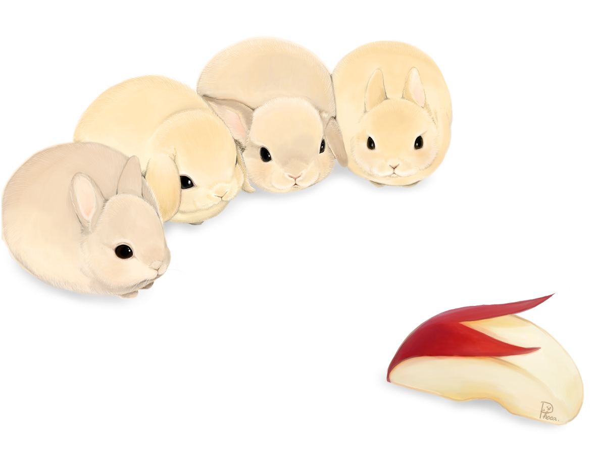
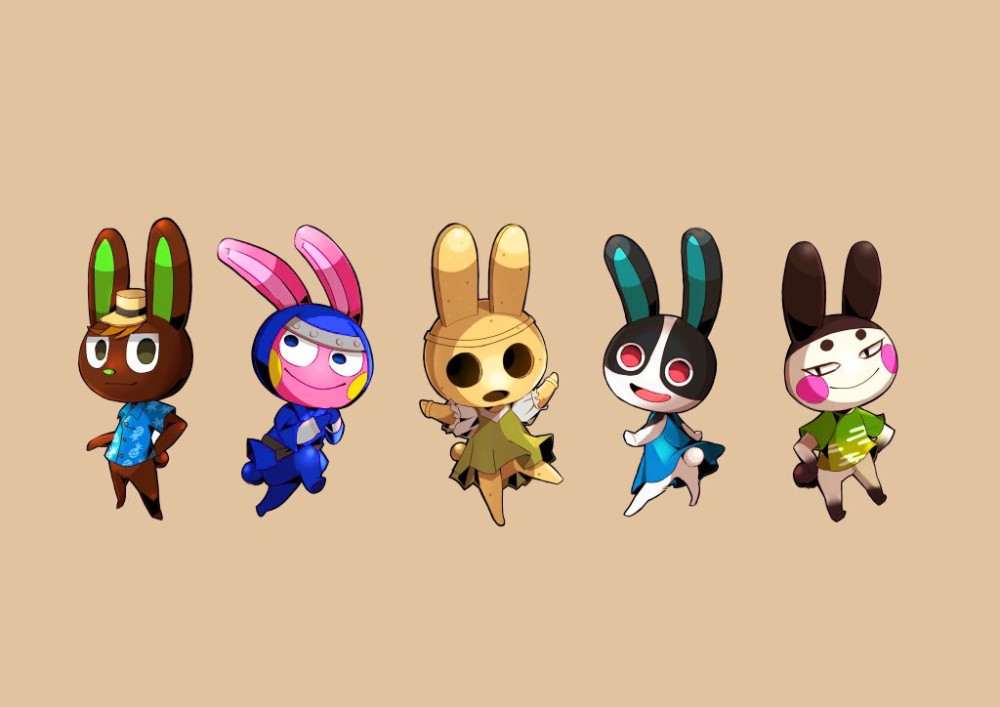
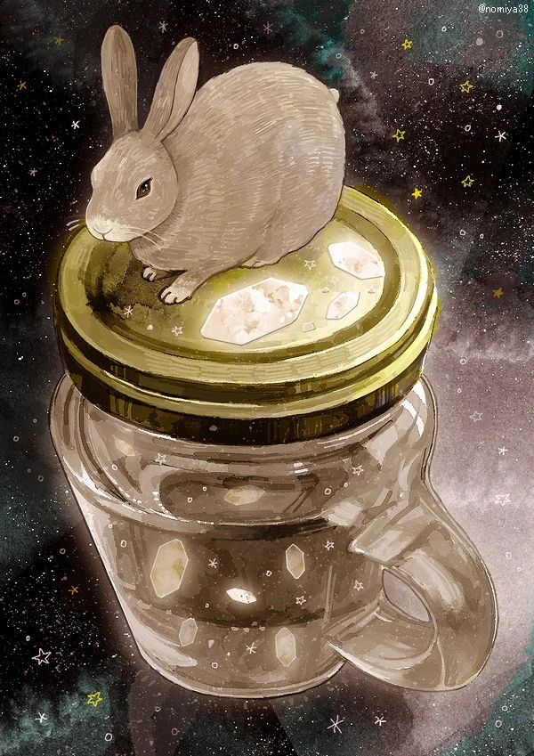
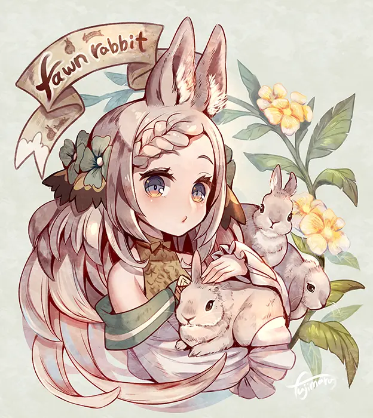
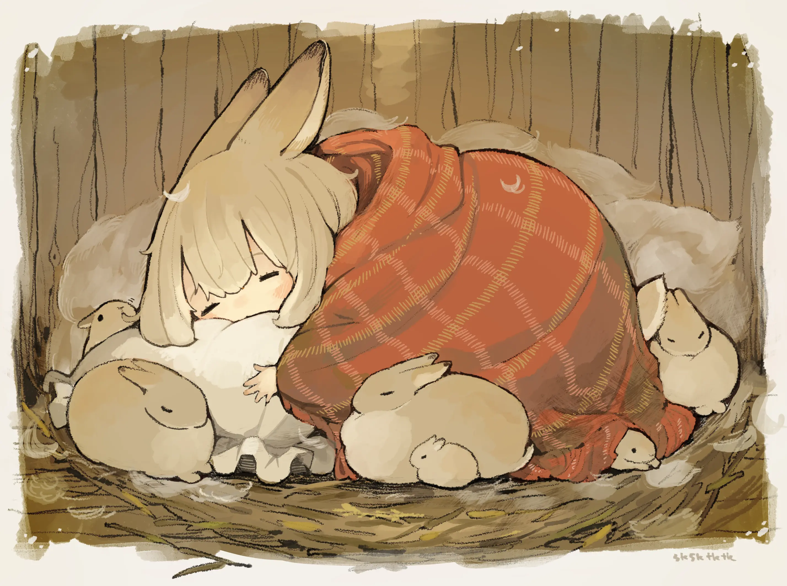

明天就是新的一年了呢。

今年真是发生了许多事情。

经历了异常紧张的高三生活，参加了高考，（当然）没能超常发挥，和自己的理想有亿点点落差。所幸还是考上了不错的大学，选择了喜欢的计算机类专业。接下来还需努力学习，希望能够有所成就吧。至于❤️️宝宝❤️️，好像更惨一点🤣，未来可期！

新冠疫情再度爆发，持续了三年的封控政策终于崩溃，中国迎来了全面放开。不幸的是我和身边很多人都🐏了……所幸在家，能够充分休息，很快恢复了健康。虽然全面放开了，但因为害怕接触阳性，反而更加不敢出门了。疫情之下，中国将要何去何从，现在仍不明朗。希望接下来疫情能够有所好转吧。

疫情影响下，学期提前结束。赋闲在家，终于把一直依赖想玩的云服务器给搭了，然后也给自己建了一些网站：[https://alspace.anlor.top](https://alspace.anlor.top), [https://www.anlor.top](https://www.anlor.top), [https://blog.anlor.top](https://blog.anlor.top)。寒假还希望能够把计组、网络、雅思、数学都学完🙂！

新的一年将是兔年。希望明年能像兔子一样充满活力！也希望我的❤️能够一切顺利。

最后来点兔年贺图。以下图片来自合集：[兔年即将到来！ - 兔子插画特辑 -](https://www.pixivision.net/zh/a/8193)

